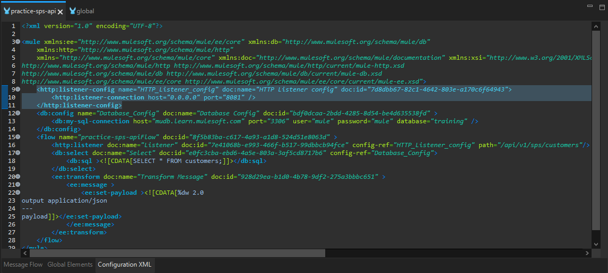
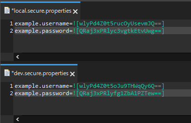
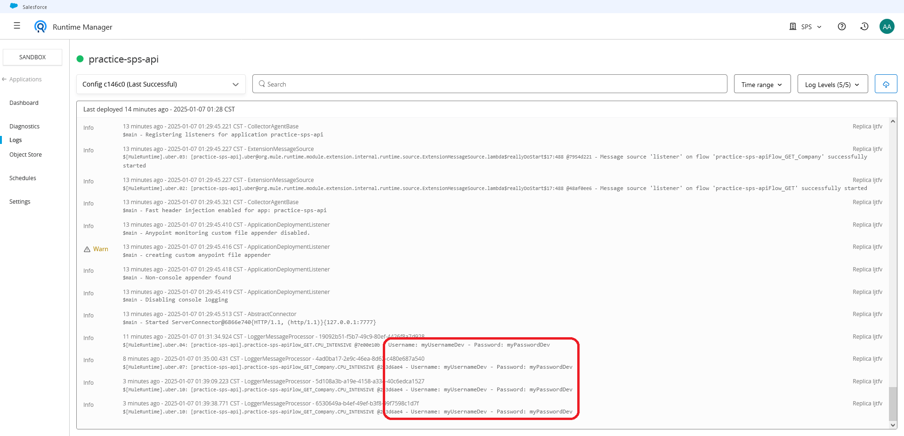
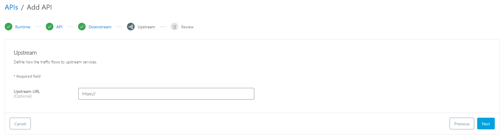
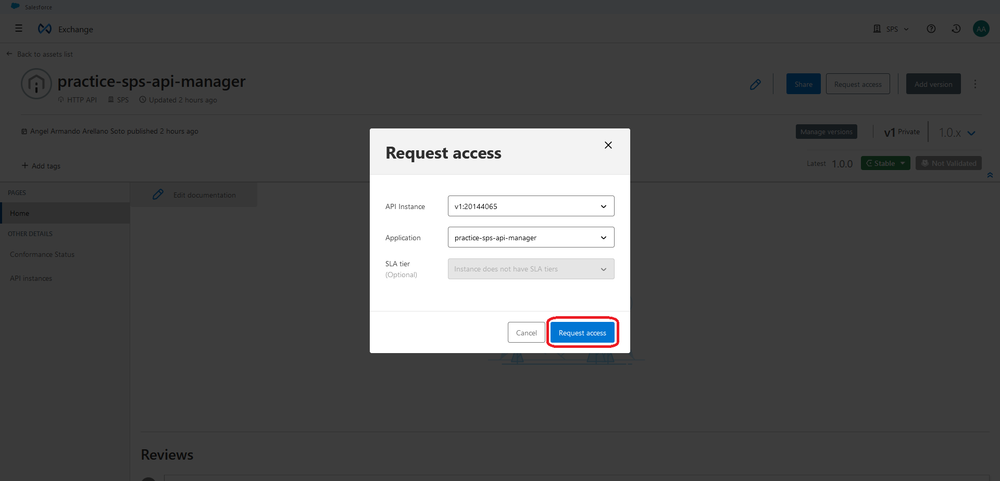

# **SPS Customers API - Documentación**

**Autor:** *Angel Armando Arellano Soto.*  
**Fecha:** *7 de enero de 2025.*

---

## **Tabla de Contenidos**
- [**SPS Customers API - Documentación**](#sps-customers-api---documentación)
  - [**Tabla de Contenidos**](#tabla-de-contenidos)
  - [**Introducción**](#introducción)
  - [**Requerimientos**](#requerimientos)
    - [**Herramientas:**](#herramientas)
    - [**Detalles del proyecto:**](#detalles-del-proyecto)
  - [**Desarrollo**](#desarrollo)
    - [**Preparación del Entorno**](#preparación-del-entorno)
    - [**Creación del Proyecto**](#creación-del-proyecto)
    - [**Diseño del API**](#diseño-del-api)
    - [**Conexión a la Base de Datos**](#conexión-a-la-base-de-datos)
    - [**Pruebas Locales**](#pruebas-locales)
    - [**Implementación de Buenas Prácticas**](#implementación-de-buenas-prácticas)
    - [**Protección de las Propiedades**](#protección-de-las-propiedades)
  - [**Extras implementados**](#extras-implementados)
    - [**Métodos Permitidos**](#métodos-permitidos)
  - [**Despliegue en CloudHub**](#despliegue-en-cloudhub)
  - [**Creación de API en API Manager**](#creación-de-api-en-api-manager)
    - [**Despliegue en CloudHub**](#despliegue-en-cloudhub-1)
    - [**Implementación de Client ID enforcement**](#implementación-de-client-id-enforcement)
  - [**Conclusión**](#conclusión)

---

## **Introducción**

El equipo de marketing de SPS necesita acceder a información de clientes almacenada en una base de datos para personalizar campañas y mejorar la satisfacción del cliente. Este proyecto implementa una API en MuleSoft que expone estos datos de manera segura y eficiente, cumpliendo con los requisitos propuestos y explorando mejoras adicionales.

---

## **Requerimientos**
### **Herramientas:**
- **Cuenta en Anypoint Platform:** [*Crear cuenta*](https://anypoint.mulesoft.com/login/signup?apintent=generic)
- **Anypoint Studio:** [*Descargar*](https://www.mulesoft.com/lp/dl/anypoint-mule-studio)
- **Postman:** [*Descargar*](https://www.postman.com/downloads)
- **Secure Properties Tool:** [*Descargar*](https://docs.mulesoft.com/mule-runtime/latest/secure-configuration-properties#secure_props_tool)

### **Detalles del proyecto:**
- **Endpoint**: `/api/v1/sps/customers`
- **Base de Datos:** MySQL
  - Host: `mudb.learn.mulesoft.com`
  - Puerto: `3306`
  - Usuario: `mule`
  - Contraseña: `mule`
  - Base de datos: `training`
- **Protección de credenciales**: Secure Properties.
- **Despliegue**: CloudHub.

---

## **Desarrollo**

### **Preparación del Entorno**

1. **Abrir Anypoint Studio**
    
   Al iniciar Anypoint Studio, aparecerá la siguiente ventana:

   

2. **Configurar el Espacio de Trabajo**

   Por defecto, se mostrará una ubicación para el espacio de trabajo. Si prefieres una ubicación diferente, selecciona la ruta y el nombre deseados. Luego, haz clic en **Launch**.

### **Creación del Proyecto**

1. **Iniciar la Creación del Proyecto**

   Una vez abierto el entorno, existen dos maneras de crear un proyecto:

   - Desde el menú principal: Ve a **File > New > Mule Project**.
   - Desde el área de trabajo **Package Explorer**: Selecciona **Create a Mule Project**.

   

2. **Configurar el Nuevo Proyecto**

   Aparecerá la ventana **New Mule Project**. Aquí debes:

   - Asignar un nombre al proyecto.
   - Hacer clic en **Finish** para completar la creación.

   


### **Diseño del API**

1. **Vista del Entorno tras la Creación del Proyecto**

   Una vez creado el proyecto, el entorno se verá de la siguiente manera:

   

2. **Agregar un Listener**

   - En la sección **Mule Palette**, localiza el módulo **HTTP** dentro de "Favorites" o utiliza la barra **Search in palette** para buscar el elemento **Listener**.
   - Arrastra el **Listener** a la sección del **Lienzo** (también conocida como "Canvas").

   

3. **Configurar el Listener**

   - Una vez agregado el **Listener**, se verá como en la siguiente imagen.
   - Haz clic en el signo verde **+** de **Connector configuration**.

    

4. **Configurar el Conector Global**

   - Se abrirá la ventana **Global Element Properties**.
   - Deja la configuración por defecto y haz clic en **OK**.

   

5. **Definir el Path del Listener**

   - En la sección **General** del Listener, ingresa el Path: `/api/v1/sps/customers`.

   

### **Conexión a la Base de Datos**

1. **Agregar el Módulo de Base de Datos**

   - En la sección **Mule Palette**, selecciona **Add Modules**.
   
      

   - En la parte derecha, localiza el módulo **Database** y arrástralo a la parte izquierda.

      

2. **Agregar el Componente Select**

   - En el módulo **Database** de la sección **Mule Palette**, localiza el componente **Select**.
   - Arrastra el componente **Select** al proceso en el **Flow**, como se muestra:

      

3. **Configurar el Conector de Select**

   - En las propiedades del componente **Select**, haz clic en el signo verde **+** para agregar la configuración del conector.

      

4. **Configurar las Propiedades del Elemento Global**

   - Se abrirá la ventana **Global Element Properties**.
   - Configura el driver seleccionando **Configure** y luego haz clic en **Add Maven dependency**.

     

5. **Agregar la Dependencia de Maven**

   - En la ventana **Maven dependency**, busca el driver tecleando "mysql-" en **Search Maven Central**.
   - Selecciona la versión del conector con Java y haz clic en **Edit selected**.

       

6. **Configurar la Versión del Conector**

   - Selecciona la versión **8.0.16** del conector, ya que las versiones recientes pueden tener problemas.
   - Haz clic en **Finish** y espera a que se instale la dependencia.

      

7. **Seleccionar la Conexión MySQL**

   - Regresará a la ventana anterior, selecciona **MySQL Connection** en el campo **Connection**.

     

8. **Configurar la Conexión a la Base de Datos**

   - Introduce los siguientes datos de conexión:

     **Configuración de Conexión:**
     - Host: `mudb.learn.mulesoft.com`
     - Puerto: `3306`
     - Usuario: `mule`
     - Contraseña: `mule`
     - Base de datos: `training`

     

   - Haz clic en **OK** para guardar la configuración.

9. **Escribir la Consulta SQL**

   - En la sección del componente **Select**, ingresa la consulta en el campo **SQL Query Text**.

     **Consulta a realizar:**
     ```sql
     SELECT * FROM customers;
     ```

     

### **Pruebas Locales**

1. **Guardar todos los cambios**

   Para guardar todos los cambios realizados hasta el momento, haz clic en el icono **"Save All"**, ubicado en la parte superior izquierda de la ventana.

   

2. **Ejecutar el proyecto**

   - Haz clic derecho sobre el área del **canvas** y selecciona la opción **"Run Project"**.
   - Espera a que el proyecto se ejecute correctamente.

   

3. **Verificar el estado en la consola**

   Una vez que el proyecto se haya ejecutado, verifica el estado en la consola. Si aparece **DEPLOYED**, significa que no hubo errores y todo está funcionando correctamente.

   

4. **Abrir Postman para probar la API**

   Abre **Postman** para realizar una solicitud a la API y asegurarte de que está funcionando correctamente. Haz clic en el icono de **"HTTP Request"** para crear una nueva solicitud.

   

5. **Realizar una solicitud GET**

   - Selecciona el método **"GET"** en Postman.
   - Ingresa la URL correspondiente para realizar la prueba de la API.

    

6. **Esperar la respuesta**

   Al hacer clic en **"Send"**, es posible que recibas un error **500 Server Error**. Este error ocurre porque los datos obtenidos desde la base de datos deben ser transformados para que puedan ser visualizados correctamente.

   

7. **Agregar el transformador de mensaje**

   - En la sección **Mule Palette**, busca el componente **"Transform Message"** dentro de la categoría **Core**.
   - Arrastra el componente **"Transform Message"** al canvas, ubicándolo a la derecha del componente **Select**.

    

8. **Configurar el transformador de mensaje**

   - Una vez agregado el transformador de mensaje, configura las propiedades para modificar el **output**. Esto nos permitirá transformar los datos al formato deseado.

   

9. **Verificar la respuesta en formato Java**

   El formato por defecto es **"application/java"**. Si dejas esta configuración, la respuesta será **"200 OK"**, pero los datos no serán legibles.

   

10. **Cambiar el formato de salida a JSON**

    Para que la respuesta sea legible, cambia el formato de salida a **JSON**, utilizando el siguiente código en el transformador de mensaje:

    ```dw
    %dw 2.0
    output application/json
    ---
    payload
    ```

    En este caso, **payload** hace referencia a los datos obtenidos desde el evento de Mule.

    

11. **Guardar los cambios nuevamente**

    - Haz clic en **Save All** para guardar los cambios sin detener la aplicación. Mule aplicará los cambios de manera automática gracias a la característica **Run in Time**.

        

    > **Nota:** Si tienes más de un archivo de configuración, no es recomendable guardar sin detener la aplicación, ya que esto podría causar conflictos.

12. **Verificar la respuesta en formato JSON**

    Regresa a **Postman**, haz clic nuevamente en **"Send"** y ahora recibirás la respuesta **"200 OK"** con los datos en formato **JSON**, lo que indica que la transformación se realizó correctamente.

    

### **Implementación de Buenas Prácticas**

1. **Crear un archivo global.xml**

   Como primer paso, para aplicar buenas prácticas, crea un archivo **"global.xml"** donde almacenarás los elementos globales. Esto es útil especialmente cuando tienes múltiples archivos XML, ya que permite acceder a los elementos globales desde un único archivo. Para hacerlo, haz clic derecho en **src/main/mule** dentro de **Package Explorer**, selecciona **New > Mule Configuration File**.

   

2. **Asignar nombre al archivo**

   En la ventana que se abre, ingresa el nombre **"global.xml"** y haz clic en **Finish**.

   

3. **Cortar el código del archivo "practice-sps-api.xml"**

   Regresa al archivo **"practice-sps-api.xml"** y ubica la sección **"http:listener-config"** en la vista **"Configuration XML"** del canvas. Luego, corta el código relacionado con la configuración del listener.

   

4. **Pegar el código en el archivo global.xml**

   Dirígete al archivo **"global.xml"**, ubica la vista **"Configuration XML"** y pega el código cortado antes de cerrar el tag `</mule>`. Aparecerá un mensaje de advertencia solicitando regenerar los ID de los componentes, selecciona **Yes**, pero sin marcar la casilla **"Remember my choice"**.

   

5. **Resultado de la configuración**

   El código en el archivo **"global.xml"** debería verse de la siguiente manera:

   

6. **Guardar todos los cambios**

   Si se muestra algún error, este desaparecerá después de guardar todos los archivos. Para hacerlo, haz clic en **Save All**.

    

7. **Externalizar los valores codificados**

   Para facilitar la modificación de valores, especialmente en proyectos más grandes, externalizaremos las propiedades codificadas. En este caso, solo tenemos un elemento global, pero este enfoque es muy útil cuando el proyecto crece. Ve al archivo **"global.xml"** y cambia a la vista **"Global Elements"**. Luego, haz clic en **"HTTP Listener config"** y selecciona el botón **"Edit"**.

   

8. **Externalizar propiedades en el Listener**

   Se abrirá una nueva ventana. Sustituye los valores codificados por propiedades. En este caso, utiliza `${http.listener.host}` para el host y `${http.listener.port}` para el puerto. Después, haz clic en **OK**.

   

9. **Crear archivo "local.properties"**

   Ahora, para evitar tener valores hardcodeados, vamos a externalizarlos en archivos de propiedades. Primero, crea el archivo **"local.properties"**. Haz clic derecho en **src/main/resources** y selecciona **New > File**.

   

10. **Asignar nombre al archivo "local.properties"**

    En la ventana que se abre, asigna el nombre **"local.properties"** y haz clic en **Finish**.

    

11. **Definir las propiedades en "local.properties"**

    Abre el archivo **"local.properties"** y agrega las siguientes propiedades:

    ```
    http.listener.host=0.0.0.0
    http.listener.port=8081
    ```

    

12. **Crear archivo "dev.properties"**

    Repite los pasos anteriores (9, 10 y 11) para crear el archivo **"dev.properties"**. El archivo deberá contener las mismas propiedades que el archivo anterior, pero puede tener configuraciones diferentes para el entorno de desarrollo.

    

13. **Guardar todos los archivos**

    Después de realizar estos cambios, guarda todos los archivos.

      

14. **Añadir los archivos de propiedades a Mule**

    Para que Mule pueda encontrar los archivos de propiedades, ve al archivo **"global.xml"** y cambia a la vista **Global Elements**. Haz clic en el botón **"Create"** para añadir un nuevo elemento global.

    

15. **Seleccionar "Configuration properties"**

    En la nueva ventana, busca y selecciona **"Configuration properties"**, luego haz clic en **OK**.

    

16. **Configurar las propiedades del entorno**

    Debido a que los archivos de propiedades no son estáticos, debes ser capaz de cambiar el archivo en función del entorno. En la ventana de configuración, agrega lo siguiente:

    ```
    ${env}.properties
    ```

    Esto permitirá que Mule utilice el archivo de propiedades correspondiente según el valor de la propiedad **env**.

    

17. **Añadir la propiedad "env"**

    Ahora, crea la propiedad **"env"** en **Global Properties**. Haz clic en **Create** nuevamente, selecciona **"Global Property"** y haz clic en **OK**.

    

18. **Configurar la propiedad "env"**

    En la ventana que aparece, asigna el nombre **"dev"** y el valor **"local"**. Luego haz clic en **OK**.

    

19. **Guardar todos los archivos**

    Guarda nuevamente todos los archivos para asegurar que los cambios sean aplicados.

    

20. **Ejecutar el proyecto**

    Finalmente, ejecuta el proyecto para verificar que todo esté funcionando correctamente. Haz clic derecho en el lienzo y selecciona **"Run project"**.

    

21. **Verificar el estado en la consola**

    Una vez que el proyecto esté listo, verifica la consola. Si el estado es **DEPLOYED**, significa que todo está funcionando correctamente.

    

22. **Verificar la respuesta en Postman**

    Regresa a **Postman**, haz clic en **"Send"** y recibirás la respuesta **"200 OK"** con los datos en formato **JSON**, indicando que el proyecto está funcionando correctamente.

    

### **Protección de las Propiedades**

En esta sección, se abordará la creación de archivos de propiedades de manera segura para almacenar variables globales, tokens, claves únicas o credenciales de inicio de sesión. Estas propiedades se almacenarán en un solo archivo para mantener el proyecto más organizado y se crearán archivos separados según el entorno, respetando las buenas prácticas.

1. **Crear el archivo "local.secure.properties"**

   Comienza creando el archivo **"local.secure.properties"**. Haz clic derecho en **src/main/resources** y selecciona **New > File**.

   

2. **Asignar nombre al archivo**

   En la ventana que se abre, asigna el nombre **"local.secure.properties"** y haz clic en **Finish**.

    

3. **Agregar contenido al archivo**

   Ahora, agrega las siguientes líneas al archivo **"local.secure.properties"**:

   ```
   example.username=myUsernameLocal
   example.password=myPasswordLocal
   ```
    

4. **Repetir para "dev.secure.properties"**

   Repite los pasos 1, 2 y 3 para crear el archivo **"dev.secure.properties"**. El contenido deberá ser similar al del archivo anterior.

   

5. **Agregar módulo "Mule Secure Configuration Properties"**

   En la sección **Mule Palette**, selecciona **Search in Exchange** para agregar un nuevo módulo al proyecto.

    

6. **Seleccionar "Mule Secure Configuration Properties"**

   En la ventana que aparece, busca **"Mule Secure Configuration Properties"**, selecciona el módulo y haz clic en **Add >**, luego en **Finish**.

   

7. **Configurar en "global.xml"**

   Ve al archivo **"global.xml"** en la vista **Global Elements** y haz clic en el botón **Create**.

   

8. **Seleccionar "Secure Properties Config"**

   En la nueva ventana, busca **"Secure Properties Config"**, selecciónalo y haz clic en **OK**.

   

9. **Configurar propiedades de seguridad**

   En la nueva ventana, configura los siguientes valores:

   - En el campo **archivo**, coloca `${env}.secure.properties`.
   - En el campo **llave**, coloca `${secure.key}`.
   - Cambia el algoritmo a **Blowfish** para garantizar la seguridad en la encriptación.

   Esto evitará que las propiedades se incluyan en el código y las pasará de forma segura durante la ejecución de la aplicación, ya sea en el entorno local o en CloudHub. Después de asignar los valores, haz clic en **OK**.

   

10. **Guardar todos los archivos**

    Guarda todos los archivos para aplicar los cambios.

    

11. **Configurar un "Logger"**

    Ahora, vamos a configurar un **Logger** para leer las credenciales seguras. Abre el archivo **"practice-sps-api"** y arrastra el componente **Logger** desde **Mule Palette** hacia la derecha de **Transform Message**.

    

12. **Configurar propiedades del Logger**

    En las propiedades del Logger, haz clic en el botón **fx** y luego en el botón que aparece a la derecha.

    

13. **Agregar el código de descifrado**

    En la vista que se abre, agrega el siguiente código para indicar que se necesita descifrar los valores de las propiedades:

    ```java
    output application/java
    ---
    "Username: " ++ Mule::p("secure::example.username")
    ++ " - " ++
    "Password: " ++ Mule::p("secure::example.password")
    ```

    Esto permitirá que los valores se descifren antes de ser utilizados.

    

14. **Guardar todos los archivos**

    Guarda todos los archivos nuevamente.

    

15. **Cifrar los valores de las propiedades**

    Utiliza la herramienta **Secure Properties Tool Jar file** para cifrar los valores de las propiedades. Esto devolverá un valor encriptado para las cadenas de texto que ingreses. Asegúrate de usar la clave **"MyMuleSoftKey123"** (mínimo 16 caracteres) para la encriptación. Abre una terminal en el directorio donde descargaste el archivo **secure-properties-tool.jar** y ejecuta el siguiente comando para cifrar **"myUsernameLocal"**:

    En **SO Windows**:
    ```console
    java -cp secure-properties-tool.jar com.mulesoft.tools.SecurePropertiesTool string encrypt Blowfish CBC MyMuleSoftKey123 "myUsernameLocal"
    ```

    

16. **Pegar el valor cifrado**

    El valor cifrado obtenido deberá pegarse en el archivo correspondiente, en este caso en **"local.secure.properties"**, usando la siguiente sintaxis:

    ```
    example.username=![encryptedValue]
    ```

    

17. **Repetir para las demás propiedades**

    Repite el proceso para todas las propiedades de **"local.secure.properties"** y **"dev.secure.properties"**, utilizando el valor cifrado correspondiente.

    

18. **Configurar la propiedad "secure.key"**

    Configura la propiedad **secure.key** desde la configuración de inicio de la aplicación para que pueda descifrar los valores en tiempo de ejecución. Haz clic derecho en el Proyecto, luego selecciona **New > Run As > Run Configurations...**

    

19. **Agregar variable de entorno "secure.key"**

    En la nueva ventana, selecciona el proyecto, ve a la sección **Environment** y haz clic en **Add...**. En la ventana que aparece, ingresa el nombre **secure.key** y el valor **MyMuleSoftKey123**. Haz clic en **OK**, luego en **Apply** y finalmente en **Run**.

    

20. **Verificar los valores descifrados en consola**

    Realiza una prueba con Postman y verifica en la consola que los valores descifrados se muestren correctamente.

    

---

## **Extras implementados**

Como punto adicional, me gustaría agregar otro método, en este caso GET, pero filtrando por el nombre de la compañía a la cual pertenecen los clientes. En la base de datos hay 3 compañías diferentes, las cuales son: "Kazu", "Skibox" y "NPR". Estos métodos tienen la finalidad de mostrar solo los clientes de una compañía en específico.

### **Métodos Permitidos**

Ya que la finalidad de la práctica es obtener datos solamente. Vamos a indicar que el metodo **GET** sea el unico permitido por la aplicación.

1. **Configurar los métodos permitidos en el Listener**

   Para hacer esto, haz doble clic en el Listener y en sus propiedades **"Advanced"**, dejando únicamente marcado **"GET"** como el método permitido.

   

2. **Copiar el flujo para crear el segundo método**

   Ahora, selecciona todo el elemento **"practice-sps-apiFlow"** y pulsa la combinación de teclas **"Ctrl + C"** para copiar. Luego, haz clic en el canvas y pulsa **"Ctrl + V"**. Quedará de la siguiente manera:

   

3. **Renombrar los flujos para identificarlos fácilmente**

   Cambiaremos los nombres de los flujos para identificar mejor cada método. Haz clic derecho en **"practice-sps-apiFlow"** y selecciona **"Rename"**, agregando al final del nombre **"_GET"**.

   

4. **Renombrar el flujo del segundo método**

   Repite el paso anterior para **"practice-sps-apiFlow1"**, pero elimina el "1" del nombre y agrega al final **"_GET_Company"**. Quedando de la siguiente forma:

   

5. **Modificar el Listener del método GET_Company**

   En este momento, ambos métodos hacen lo mismo. Para cambiarlos, ve al **Listener** del método **GET_Company** y modifica el **Path** por **"/api/v1/sps/customers/{Company}"**, de esta manera indicamos que **Company** espera un parámetro.

   

6. **Modificar la consulta SQL para filtrar por compañía**

   También debes modificar la consulta SQL dando doble clic en el elemento **Select** del método **GET_Company**. La nueva consulta será la siguiente, para poder obtener el valor del atributo **Company**:

   ```sql
    SELECT *
    FROM customers
    WHERE Company = :Company
   ```
    

7. **Configurar los parámetros de entrada para el método GET_Company**

   Después, en **Input Parameters**, debemos indicar el nombre de la variable para obtener el valor de los atributos. Haz clic en **"fx"** e ingresa lo siguiente:

   ```java
   {'Company' : attributes.uriParams.Company}
   ```
   
    

8. **Guardar y probar el flujo**

   Guarda todos los archivos y corre el proyecto. Ahora, con ayuda de **Postman**, prueba si funciona correctamente el filtrado por compañía. Para los tres casos, realiza las siguientes peticiones:

   - Para la compañía **Kazu**:

        ```
        localhost:8081/api/v1/sps/customers/Kazu
        ```
        

   - Para la compañía **Skibox**:
        
        ```
        localhost:8081/api/v1/sps/customers/Skibox
        ```
        

   - Para la compañía **NPR**:
        
        ```
        localhost:8081/api/v1/sps/customers/NPR
        ```
        

---

## **Despliegue en CloudHub**

Después de probar localmente el proyecto, es hora de desplegar la aplicación en **CloudHub**.

1. **Editar el archivo mule-artifact.json**

   Localiza el archivo **"mule-artifact.json"**, ábrelo y agrega la siguiente línea para asegurar que el valor de **secure.key** se mantenga oculto.

   

2. **Desplegar la aplicación en CloudHub**

   Haz clic derecho en el proyecto y selecciona **Anypoint Platform > Deploy to CloudHub**.

   

3. **Iniciar sesión en Anypoint Platform**

   Aparecerá una ventana solicitando que inicies sesión con tus credenciales de la plataforma.

   

4. **Seleccionar el entorno Sandbox**

   Elige el entorno **Sandbox** para el despliegue.

   

5. **Verificación del nombre de la aplicación**

   Si ves una **X roja** junto al nombre de la aplicación, selecciona otro nombre disponible para la aplicación.

   

6. **Configurar las variables de entorno**

   En la sección **Properties**, configura las variables de entorno:

   - **Key**: `env`, **Value**: `dev`
   - **Key**: `secure.key`, **Value**: `MyMuleSoftKey123`

   

7. **Iniciar el despliegue de la aplicación**

   Regresa a la sección **Runtime** y verifica los valores correspondientes. Desplaza la ventana hasta el final y haz clic en **"Deploy Application"**. Ten en cuenta que el proceso de despliegue puede tardar algunos minutos.

   

8. **Abrir Runtime Manager en el navegador**

   Al finalizar el despliegue, se abrirá una ventana para acceder a **"Runtime Manager"** desde el navegador. Haz clic en **"Open in Browser"** e inicia sesión.

   

9. **Verificar el estado de la aplicación**

   En **Runtime Manager**, busca la aplicación y haz clic en su nombre para acceder al panel de control. Una vez desplegada por completo, copia el **Public Endpoint** para probar que la aplicación funciona correctamente.

   

10. **Probar el endpoint en Postman**

    Usa **Postman** para probar el **Public Endpoint**. Verás la respuesta **200 OK** con los datos en formato **JSON**.

    

    

    

    

11. **Verificar los logs en Runtime Manager**

    Finalmente, revisa los logs de **Runtime Manager** para verificar que el usuario correspondiente al entorno esté presente.

    

---

## **Creación de API en API Manager**

Para gestionar y activar políticas de seguridad, se debe crear una API en **API Manager**.

1. **Iniciar sesión en Anypoint Platform**

   Inicia sesión en **Anypoint Platform** y dirígete a **API Manager**. Una vez en **API Manager**, haz clic en **Add API** y luego en **Add new API**.

   

2. **Configurar la API**

   Configura la API de acuerdo con la aplicación. En este caso, selecciona **HTTP API** como tipo de API, ya que se está utilizando un endpoint y es una aplicación Mule. Luego, haz clic en **Next**.

   

3. **Asignar nombre y tipo de API**

   Asigna un nombre a la API y selecciona el tipo de asset como **HTTP API**. Después, haz clic en **Next**.

   

4. **Configuraciones Downstream**

   Deja las configuraciones **Downstream** por defecto. Haz clic en **Next**.

   

5. **Configuraciones Upstream**

   Deja las configuraciones **Upstream** por defecto. Haz clic en **Next**.

   

6. **Revisión de la API**

   En la vista de **Review**, revisa los detalles de las configuraciones. Haz clic en **Save** para guardar la configuración.

   

7. **Obtener el API Instance ID**

   Una vez creada la API, se mostrará el **API Instance ID**. Copia este ID para usarlo en la integración de API Autodiscovery en **Anypoint Studio**.

   

8. **Agregar la propiedad "api.id" al proyecto**

   Agrega la propiedad **"api.id"** en los archivos **local.properties** y **dev.properties** de tu proyecto.

   

9. **Agregar el elemento API Autodiscovery**

   Dirígete al archivo **global.xml**. En la vista **Global Elements**, haz clic en el botón **Create**, busca **API Autodiscovery**, selecciona el elemento y haz clic en **OK**.

   

10. **Configurar API Autodiscovery**

    En la ventana de configuración, asigna el valor `${api.id}` y selecciona el flujo correspondiente del proyecto.

    

11. **Repetir configuración si es necesario**

    Si existen varios flujos en el proyecto, repite el paso anterior para cada uno de los flujos.

    .png "API Autodiscovery Settings (2)")

12. **Obtener Client ID y Client Secret**

    Regresa a **Anypoint Platform** y ve a la página principal de **API Manager**. Haz clic en el botón **Environment** y copia las credenciales **Client ID** y **Client Secret**.

    

13. **Configurar las credenciales en Anypoint Studio**

    Vuelve a **Anypoint Studio** y abre las **Preferencias**.

    

14. **Pegar las credenciales en API Manager**

    En las preferencias, navega a **Anypoint Studio > API Manager**. Pega las credenciales **Client ID** y **Client Secret** que copiaste de **API Manager**. Haz clic en **Validate** para verificar que las credenciales sean correctas, luego haz clic en **Apply and Close**.

    

15. **Verificar que el proyecto esté funcionando**

    Para verificar que no haya errores en el proyecto, ejecútalo. En la consola, asegúrate de que la aplicación esté en **STATUS DEPLOYED**. Luego, abre **Postman** y realiza una solicitud para verificar que se reciba una respuesta **200 OK**.

    

    

### **Despliegue en CloudHub**

Ahora se volverá a desplegar la aplicación en **CloudHub** con la finalidad de actualizar las credenciales del entorno.

1. **Abrir el archivo mule-artifact.json**

   Dirígete al archivo **mule-artifact.json** y añade las propiedades **client.id** y **client.secret** para mantener las credenciales seguras.

   

2. **Guardar todos los archivos**

   Asegúrate de guardar todos los archivos para que los cambios se apliquen correctamente.

   

3. **Desplegar a CloudHub**

   Haz clic derecho en el proyecto y selecciona **Anypoint Platform > Deploy to CloudHub** para desplegar la aplicación nuevamente a **CloudHub**.

   

4. **Configurar las propiedades en CloudHub**

   Una vez que estés en la ventana de **CloudHub**, ve a la sección de **Properties** e introduce el **Client ID** y **Client Secret**. Después, haz clic en **Apply Changes** y espera a que se apliquen.

   

### **Implementación de Client ID enforcement**

En esta parte se implementará la política **Client ID enforcement** para asegurarnos de que la aplicación Mule cuente con autenticación básica.

1. **Acceder a la API Manager**

   Primero, ve a **Anypoint Platform > API Manager**, selecciona la API correspondiente y luego dirígete a la sección **Policies**. Posteriormente, haz clic en **"+ Add policy"**.

   

2. **Seleccionar Client ID Enforcement**

   En la página que se abre, busca **"Client ID Enforcement"**, selecciona la política y haz clic en **Next**.

   

3. **Seleccionar configuración básica**

   Ahora, selecciona la configuración básica y haz clic en **Apply** para aplicar la política.

   

4. **Verificar en Postman**

   Si ahora vas a **Postman** y haces una petición a la API, recibirás una respuesta **401 Unauthorized**, lo que indica que la política de **Client ID Enforcement** está funcionando correctamente.

   

5. **Ir a Exchange en Anypoint Platform**

   Ahora, ve a **Anypoint Platform > Exchange**, donde aparecerá la API HTTP publicada. Haz clic en la API.

    

6. **Solicitar acceso a la API**

   Se abrirá la vista previa de la API. Haz clic en **Request access (1)**, selecciona la **API Instance**, luego, en la parte de **Application**, haz clic en **Create a new application (2)**.

   

7. **Crear nueva aplicación**

   En la ventana que aparece, asigna un nombre a la aplicación y haz clic en el botón **Create**.

   

8. **Solicitar acceso**

   Regresarás a la ventana anterior, donde ahora debes hacer clic en el botón azul **Request access**.

   

9. **Obtener Client ID y Client Secret**

   Ahora, se mostrará el **Client ID** y el **Client Secret**. También te proporcionará un vínculo para recuperar la información de las credenciales. Copia y guarda tanto el **Client ID** como el **Client Secret**.

   

10. **Configurar autenticación en Postman**

    Regresa a **Postman** y agrega las credenciales de autenticación básica. Para ello, ve a la pestaña **"Authorization"** y selecciona **"Basic Auth"**.

    

11. **Enviar solicitud con las credenciales**

    Pega las credenciales que copiaste previamente. En **Username** pega el **Client ID** y en **Password** pega el **Client Secret**. Una vez hecho esto, vuelve a enviar la solicitud y deberías recibir una respuesta **200 OK**, lo que confirma que la autenticación básica funciona correctamente.

    

---

## **Conclusión**

Durante el desarrollo de este proyecto, implementé una API segura que cumple con los requerimientos establecidos por el equipo de marketing. Este proceso me permitió explorar herramientas como API Manager y políticas de seguridad, las cuales reforzaron la solución final.

Aunque la documentación de MuleSoft está parcialmente desactualizada, logré superar los desafíos asociados investigando y analizando el entorno, lo que me permitió adquirir un entendimiento profundo y adaptarme a los cambios en las metodologías actuales. Aprecio las interfaces intuitivas tanto del IDE como de la plataforma web, ya que fomentan la curiosidad y facilitan el descubrimiento de nuevas funcionalidades para implementar. Esto me motivó a investigar más y a buscar soluciones creativas.

Si bien el tiempo fue un factor limitante para profundizar en algunas implementaciones adicionales, el aprendizaje obtenido a través de documentación, videos y exploración práctica fue significativo. Estoy satisfecho con los resultados obtenidos y entusiasmado por continuar desarrollando proyectos similares en el futuro.